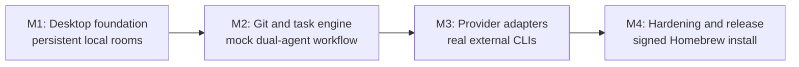

# Branchestra Implementation Roadmap

- Date: 2026-07-21
- Approved design: `docs/superpowers/specs/2026-07-21-branchestra-design.md`
- Product: Branchestra (`branchestra`)
- License: MIT
- Execution method: complete each milestone with `superpowers:subagent-driven-development` (recommended) or `superpowers:executing-plans`; do not start the next milestone until the preceding exit criteria pass.

## Outcome

These plans build an open-source, local-first macOS desktop application in four independently reviewable vertical slices. A user can install the final signed app from a terminal, add an existing Git repository, create persistent rooms, use `@Claude` or `@Codex` to propose an approved task, let the agents exchange durable checkpoints in isolated worktrees, and approve a compare-and-swap-protected final merge.

The app never implements Provider OAuth, stores Provider tokens, accepts an API key fallback, or silently changes billing paths. Users install and sign in to official CLIs outside Branchestra. Public Claude subscription support remains disabled until written Anthropic approval is committed and passes the release-policy gate.

## Milestone Order



| Milestone | Plan | Working result | Must pass before continuing |
|---|---|---|---|
| M1 | `2026-07-21-branchestra-foundation.md` | Secure Electron app can add a Git project, create rooms, post local messages, restart its worker, and replay a persistent unified timeline. | Unit/integration tests plus Electron restart-persistence journey. |
| M2 | `2026-07-21-branchestra-git-task-engine.md` | Mock Claude/Codex complete an approved two-agent workflow with worktrees, checkpoints, candidate review, immutable approval receipt, and safe final merge. | Transition, Git race, journal recovery, cancellation, and mock-provider Electron journeys. |
| M3 | `2026-07-21-branchestra-provider-adapters.md` | Supported external `claude`/`codex` CLIs can be detected, authenticated fail-closed, streamed through adapters, resumed, cancelled, and given shared context. | Contract fixtures, auth precedence, process-group cleanup, context consistency, and controlled real-provider smoke evidence. |
| M4 | `2026-07-21-branchestra-hardening-release.md` | Untrusted content stays inert; diagnostics are redacted; policy gates hold; native arm64/x64 apps are signed, notarized, released, and installed by Homebrew Cask. | Full verification, native packaged smoke, Gatekeeper, artifact scan, policy review, Cask audit, clean-machine install/upgrade. |

## Locked Technology Baseline

Every implementation plan uses exact versions. Upgrade them only in a dedicated compatibility PR that reruns the entire support matrix.

| Dependency | Version | Role |
|---|---:|---|
| Node.js | `24.18.0` | Development/CI runtime; matches Electron's embedded Node line. |
| pnpm | `11.15.1` | Package manager, pinned by `packageManager`. |
| Electron | `43.1.1` | macOS desktop runtime; minimum macOS 12.0. |
| electron-vite | `5.0.0` | Main, preload, Renderer, utility-worker, and Provider-runner entries. |
| electron-builder | `26.15.3` | Per-architecture DMG/ZIP, signing, and notarization. |
| `@electron/asar` | `4.2.0` | Release-time inspection of packaged ASAR contents. |
| TypeScript | `6.0.3` | Strict type checking; latest line supported by the pinned typescript-eslint release. |
| React / React DOM | `19.2.7` | Renderer. |
| Vite | `7.3.6` | Renderer/build pipeline within electron-vite 5's supported peer range. |
| `@vitejs/plugin-react` | `5.2.0` | React compilation compatible with Vite 7. |
| Zod | `4.4.3` | Versioned trust-boundary schemas. |
| Vitest | `4.1.10` | Unit, contract, and integration tests. |
| Playwright Test | `1.61.1` | Electron and packaged-app journeys. |
| `react-markdown` | `10.1.0` | Markdown AST rendering with raw HTML disabled. |
| `rehype-sanitize` | `6.0.0` | Secondary sanitation at the Renderer boundary. |
| Testing Library React / DOM | `16.3.2` / `10.4.1` | Renderer unit tests driven by accessible behavior. |
| jsdom | `29.1.1` | DOM environment for focused Renderer unit tests. |
| Testing Library User Event | `14.6.1` | Accessible interaction tests. |
| ESLint / `@eslint/js` | `10.6.0` / `10.0.1` | Static checks and Renderer import-boundary enforcement. |
| `typescript-eslint` | `8.65.0` | TypeScript-aware flat ESLint configuration. |
| `globals` | `17.7.0` | Explicit Node/browser globals for flat ESLint config. |
| Claude Agent SDK | `0.3.216` | Claude adapter, always pointed at an external user-installed CLI. |
| Codex SDK | `0.144.6` | Codex adapter, always pointed at an external user-installed CLI. |

SQLite uses Electron 43's embedded `node:sqlite` `DatabaseSync` in the single utility worker. This avoids a native add-on, per-architecture ABI rebuild, and ASAR-unpack surface. The storage adapter keeps SQLite-specific calls behind focused repositories so a future stability-driven driver change does not leak into workflow logic.

## Locked Source Layout

```text
branchestra/
├── build/                         # signing entitlements and app assets
├── config/                        # checked-in public policy/support inputs
├── docs/                          # design, plans, release/security documentation
├── e2e/                           # source and packaged Electron journeys
├── scripts/                       # release-policy, artifact, Cask, and config checks
├── src/
│   ├── main/                      # windows, dialogs, IPC validation, supervision
│   ├── preload/                   # one narrow frozen typed bridge
│   ├── provider-runner/           # detached SDK child entry; no SQLite or Git ownership
│   ├── renderer/                  # React UI only; no Node or privileged primitives
│   ├── shared/
│   │   ├── config/                # typed constants/feature gates
│   │   └── contracts/             # Zod wire schemas and domain DTOs
│   └── worker/
│       ├── approvals/             # durable capability and final-merge receipts
│       ├── context/               # context selection, retrieval, and hashes
│       ├── diagnostics/           # local redacted logs/export
│       ├── git/                   # the only Git mutation authority
│       ├── operations/            # side-effect intent/observe journal
│       ├── projects/              # canonical repository validation
│       ├── providers/             # adapter registry and normalized events
│       ├── rooms/                 # room/message repositories
│       ├── security/              # enforcement profiles/probes
│       ├── storage/               # SQLite connection, migrations, event store
│       └── tasks/                 # workflow state machine and orchestration
└── tests/
    ├── fixtures/                  # synthetic Git repos and redacted event recordings
    ├── integration/               # SQLite/Git/process boundaries
    ├── security/                  # negative capability matrix
    └── unit/                      # pure domain/contracts/UI behavior
```

Each file owns one responsibility. The Renderer does not import from `src/worker`, `src/main`, `node:*`, Electron, SDKs, or Git. The pinned ESLint flat config's `no-restricted-imports` rule and an Electron E2E assertion enforce that direction.

## Shared Contract Ledger

These names form the seams between plans. A plan may extend a discriminated union or make an explicitly documented pre-release schema addition at a milestone boundary, but it must update every producer, validator, and consumer in the same task. It must not silently rename an existing field or change its meaning. Because Milestones 1–3 are not distributable releases, the one planned `AppSnapshot.tasks` addition below does not claim wire compatibility between intermediate commits; any such change after the first public release requires a repository-wide migration and protocol-version bump.

### Identity and time

```ts
export type ProjectId = string;
export type RoomId = string;
export type RoomEventId = string;
export type TaskId = string;
export type AgentRunId = string;
export type CheckpointId = string;
export type ApprovalId = string;
export type OperationId = string;
export type ProviderId = "claude" | "codex";

export interface Clock {
  now(): string;
}

export interface IdGenerator {
  next(): string;
}
```

Production uses `crypto.randomUUID()` and an injected clock that returns an ISO-8601 UTC string. Tests use deterministic implementations; domain code never calls `Date.now()` or `randomUUID()` directly.

### Versioned IPC envelope

```ts
export const PROTOCOL_VERSION = 1 as const;

export interface RequestEnvelope<TType extends string, TPayload> {
  v: typeof PROTOCOL_VERSION;
  requestId: string;
  idempotencyKey: string;
  workerGeneration: string;
  type: TType;
  payload: TPayload;
}

export interface ResponseEnvelope<TType extends string, TPayload> {
  v: typeof PROTOCOL_VERSION;
  requestId: string;
  workerGeneration: string;
  type: TType;
  ok: true;
  payload: TPayload;
}

export interface ErrorEnvelope {
  v: typeof PROTOCOL_VERSION;
  requestId: string;
  workerGeneration: string;
  type: "error";
  ok: false;
  error: { code: string; message: string; retryable: boolean };
}
```

All wire values pass a discriminated Zod schema and a 65,536-byte encoded-size limit. State-changing commands are durably deduplicated by `idempotencyKey` before ACK. A stale `workerGeneration` never mutates state. After reconnect, the Renderer requests a snapshot and then events strictly after its last `roomSeq`.

### Canonical timeline event

```ts
export interface RoomEvent<TPayload = unknown> {
  id: RoomEventId;
  roomId: RoomId;
  roomSeq: number;
  type: string;
  actor: "user" | ProviderId | "system";
  createdAt: string;
  payload: TPayload;
}

export interface AppSnapshot {
  projects: Project[];
  rooms: Room[];
  roomCursors: Record<RoomId, number>;
}

export interface RoomEventCursor {
  roomId: RoomId;
  roomSeq: number;
  limit: number;
}

export interface RoomEventPage {
  roomId: RoomId;
  events: RoomEvent[];
  nextRoomSeq: number;
  hasMore: boolean;
}
```

This is the exact Milestone 1 snapshot. Milestone 2 modifies `AppSnapshotSchema`, its inferred `AppSnapshot` type, the event store, IPC fixtures, and Renderer hydration together to add the one required field `tasks: TaskInspectorModel[]`; it never introduces an `activeTasks` alias.

`roomSeq` is allocated transactionally by the worker event store. Raw Provider events are stored before their normalized `RoomEvent`; SQLite owns workflow/event truth while Git owns ref/OID/index/worktree truth.

### Storage seam

```ts
export interface Database {
  exec(sql: string): void;
  prepare(sql: string): import("node:sqlite").StatementSync;
  transaction<T>(operation: () => T): T;
  close(): void;
}

export interface EventStore {
  append(input: AppendRoomEventInput): RoomEvent;
  snapshot(): AppSnapshot;
  after(cursor: RoomEventCursor): RoomEventPage;
}
```

`AppendRoomEventInput` begins with the local `message.posted` variant and is extended as a discriminated union by later milestones. Command idempotency wraps the domain mutation in `IdempotencyStore.execute`; it is not duplicated inside `EventStore.append`. Only the utility worker opens the database. Migrations are numbered SQL files applied in one transaction per version with `foreign_keys=ON`, `journal_mode=WAL`, and a bounded `busy_timeout`.

### Task and approval seam

```ts
export type TaskState =
  | "AwaitingApproval"
  | "Preparing"
  | "Working"
  | "Checkpoint"
  | "Review1"
  | "Revision"
  | "Review2"
  | "Candidate"
  | "HumanApproval"
  | "Merging"
  | "CancelRequested"
  | "Interrupted"
  | "Reconciling"
  | "Cancelled"
  | "Failed"
  | "Completed";

export interface TaskCapabilityScope {
  repositoryRootRealpath: string;
  gitCommonDirRealpath: string;
  writableRootsRealpath: string[];
  commandClasses: Array<"build" | "test" | "lint" | "format">;
  allowCollaborator: boolean;
  toolNetwork: boolean;
  maxRunMs: number;
  collaborationRoundBudget: number;
}

export interface FinalApprovalTuple {
  targetRef: string;
  baseOid: string;
  candidateOid: string;
  diffHash: `sha256:${string}`;
  testSetHash: `sha256:${string}`;
}

export interface ApprovalReceipt {
  id: ApprovalId;
  requestId: string;
  taskId: TaskId;
  kind: "task_scope" | "additional_round" | "external_operation" | "final_merge";
  decision: "approved" | "rejected";
  scope: TaskCapabilityScope | FinalApprovalTuple | { additionalRounds: number } | { operation: string };
  scopeHash: `sha256:${string}`;
  workerGeneration: string;
  survivesWorkerRestart: boolean;
  decidedAt: string;
}
```

Task-scope approval covers only the displayed local capabilities. External state changes, destructive cleanup, new roots, new network access, `sudo`, global installation, push/deploy/publish, or expanded scope require a separate structured approval. Final merge re-reads every receipt input inside the repository lock and invalidates the receipt on any mismatch.

### Side-effect and Git seam

```ts
export interface OperationIntent<TExpected> {
  operationId: OperationId;
  idempotencyKey: string;
  kind: string;
  expected: TExpected;
  state: "intent-recorded" | "executing" | "observed" | "completed" | "uncertain";
}

export declare class GitManager {
  fastForwardCheckedOutOwner(input: {
    projectId: string; taskId: string; ownerWorktreeRealpath: string; targetRef: string;
    baseOid: string; candidateOid: string; commonDirRealpath: string;
    workerGeneration: string; idempotencyKey: string;
  }): Promise<{ mode: "checked_out_ff_only"; targetOid: string }>;
  compareAndSwapUnownedRef(input: {
    projectId: string; taskId: string; repositoryRootRealpath: string; targetRef: string;
    baseOid: string; candidateOid: string; commonDirRealpath: string;
    workerGeneration: string; idempotencyKey: string;
  }): Promise<{ mode: "unowned_update_ref_cas"; targetOid: string }>;
}

export type MergeOutcome = {
  outcome: "completed";
  mode: "checked_out_ff_only" | "unowned_update_ref_cas";
  targetRef: string;
  previousOid: string;
  targetOid: string;
};

export declare class MergeService {
  mergeApprovedCandidate(input: {
    taskId: string;
    approvalId: string;
    workerGeneration: string;
    idempotencyKey: string;
  }): Promise<MergeOutcome>;
}
```

The `GitManager` declaration above is a roadmap excerpt containing the two exact final-mutation methods added to the concrete class, not a second production interface. Worktree creation, checkpoint integration, candidate construction, reconciliation, and cleanup use the exact methods defined in the Milestone 2 plan rather than an invented aggregate API.

Every Git/process side effect is `record intent -> execute with argv and no shell -> observe actual state -> mark complete`. Git Manager is the sole authority for index, ref, branch, worktree, commit, cherry-pick, merge, and cleanup mutation. Provider tools receive read-only Branchestra Git tools and a sandbox that cannot write the Git common directory.

### Provider seam

```ts
export interface ProviderCapabilities {
  interactiveApproval: boolean;
  protocolInterrupt: boolean;
  processAbort: boolean;
  textDeltaStreaming: boolean;
  itemEventStreaming: boolean;
  sessionResume: boolean;
  workspaceWriteSandbox: boolean;
  toolNetworkControl: boolean;
  contextTools: "mcp" | "injected";
}

export interface ProviderAdapter extends TaskProviderPort {
  readonly provider: ProviderId;
  detect(): Promise<ProviderHealth>;
  probeCapabilities(executableRealpath: string): Promise<ProviderCapabilities>;
  getAuthStatus(executableRealpath: string): Promise<ProviderHealth["state"]>;
  normalizeEvent(
    raw: unknown,
    run: { runId: string; providerSeq: number; occurredAt: string },
  ): ProviderEvent[];
}
```

The production declaration is `ProviderAdapter extends TaskProviderPort`; the inherited `startRun`, `resumeRun`, and `cancelRun` signatures and `TaskProviderRunHandle.sessionId: string | null` remain exactly those established in Milestone 2. Milestone 3 only adds the validated executable path to the run request and aliases the event type to `ProviderEvent` as its contract task specifies.

Adapters must use the exact onboarding-verified external executable. Claude SDK receives `pathToClaudeCodeExecutable`; Codex SDK receives `codexPathOverride` and only the reviewed, SHA-256-pinned, CLI-version-matched authoritative effective-config lock. That lock fixes the built-in `openai` provider and official ChatGPT endpoint while replacing home/project config; version mismatch is forbidden and both release architectures must pass a malicious-endpoint zero-connection smoke. No constructor receives an API key, base URL, caller-authored provider config, custom cloud provider, or SDK-bundled executable fallback. Codex runs `approvalPolicy: "never"`; app-level approval starts a later run after a sandbox denial instead of pretending the denied tool can resume in place.

Each SDK executes inside a dedicated detached Provider-runner child. The utility worker tracks run ID, process-group ID, executable realpath, and start identity; cancellation escalates protocol/AbortController -> TERM -> verified group KILL by deadline. Restart cleanup never kills a PID on PID alone.

## Cross-Milestone Rules

1. Do not write product code while executing this roadmap document; execute one milestone plan task at a time.
2. Start implementation in an isolated worktree created with `superpowers:using-git-worktrees`.
3. Use TDD exactly as written: create one focused failing test, observe the expected failure, add the smallest implementation, observe the pass, and commit.
4. After every task, request a spec-compliance review and then a code-quality review before moving to the next task.
5. Never weaken a test, sandbox, policy gate, approval tuple, process identity check, or package scan merely to make CI green.
6. Provider recordings must be synthetic or irreversibly redacted before commit. Never commit subscription credentials, CLI session files, raw environment dumps, or proprietary repository content.
7. A Provider or CLI version missing from the support matrix is unsupported and disabled, not best-effort.
8. Worktree isolation prevents two agents overwriting the same files; it is not a security boundary against a malicious repository.
9. The app does not auto-stash, overwrite a dirty primary worktree, replay uncertain external side effects, delete interrupted work, push, deploy, publish, or continue after app exit.
10. Public release is a distinct gate from local/private technical validation. An adapter can be fully implemented and still be public-disabled for policy reasons.

## Design-Spec Coverage

| Design section | Primary milestone | Verification evidence |
|---|---|---|
| 1-4 Summary, goals, decisions, process architecture | M1 | Electron security prefs, worker handshake/lease, persistent project-room journey. |
| 4.2 IPC, replay, supervision | M1 + M4 | Envelope/dedupe tests, snapshot cursor E2E, generation/quit negative tests. |
| 5 Provider adapters and compatibility | M3 | Recorded contract fixtures, exact SDK/CLI matrix, cancel/resume integration. |
| 6 Subscription-only auth boundary | M3 + M4 | Environment/auth precedence tests, authoritative Codex config-lock hash/version checks, malicious endpoint canaries on both architectures, feature policy gate, artifact binary scan. |
| 7 Data model | M1 + M2 | SQLite migrations/repositories, event sequence, task/journal recovery tests. |
| 8 Shared context | M3 | Selection/hash tests, full-history search/read and read-only Git tool tests. |
| 9 Task state machine | M2 | Exhaustive transition table, two-round property tests, Inspector E2E. |
| 10 Git/worktrees/integration | M2 | Temporary-repo integration matrix, immutable refs, dirty owner, CAS race tests. |
| 11 Approval/security policy | M2 + M4 | Receipt validation, separate-operation approval, enforcement negative matrix. |
| 12 Cancellation/recovery | M2 + M3 + M4 | Journal crash points, provider process-group cleanup, quit/restart packaged journey. |
| 13 Desktop UX/untrusted content | M1 + M2 + M4 | Three-column UI, onboarding/Inspector journeys, malicious-content E2E. |
| 14 Privacy/diagnostics | M4 | Secret redaction, rotating logs, opt-in export tests and privacy document. |
| 15 Open-source release | M4 | MIT/notices, native signed assets, GitHub Release, Cask audit/install/upgrade. |
| 16 Test strategy | All | Each milestone's unit, contract, integration, Electron, security, and release suites. |
| 17 Acceptance criteria | All | Final `verify:all`, native packaged verification, policy/support evidence. |
| 18 Risks | All | Fail-closed adapters, exact pins, CAS, journals, capability tests, policy gates. |
| 19 Release-owned settings | M4 | Validated bundle ID, repository owner, Team ID/secrets, typed durations/retention. |

## Final Definition of Done

- A clean macOS 12+ machine can run the owner-specific `brew install --cask "${BRANCHESTRA_GITHUB_OWNER}/tap/branchestra"` command rendered from validated release configuration, open a signed/notarized native app, and later run `brew upgrade --cask branchestra`.
- Finder launch works without a shell-initialized `PATH` because onboarding persists and revalidates canonical absolute CLI paths.
- A user can add a valid existing Git repository, create multiple persistent rooms, search/replay full history, and understand which context leaves the device for each Agent run.
- `@Claude` or `@Codex` creates a readable scope request before work starts; no text emitted by an Agent can fabricate a valid approval control.
- Approved agents work only in their own managed worktrees, share context/checkpoint/test artifacts, stop automatic collaboration after two rounds, and can be cancelled without losing recoverable results.
- The Lead's final candidate includes exact OIDs, diff/test hashes, conflicts, tests, and disagreements. Only a fresh matching human receipt can change the base ref, and a dirty owner worktree is never stashed or overwritten automatically.
- App/worker/provider crashes reconcile durable state and actual Git state without blindly replaying a side effect or leaving a second owner/process group.
- Public builds contain no Provider executable, consumer credential, API fallback, raw source map, telemetry client, or background daemon. The only bundled Codex support asset is the reviewed non-executable effective-config lock, whose packaged bytes match the tracked manifest and release evidence.
- Provider support shown in the app matches current policy and exact compatibility/enforcement evidence. In particular, public Claude subscription support remains visibly unavailable until written Anthropic approval satisfies the checked-in gate.
