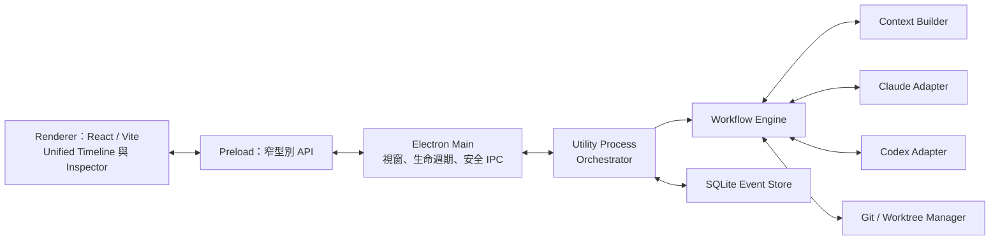
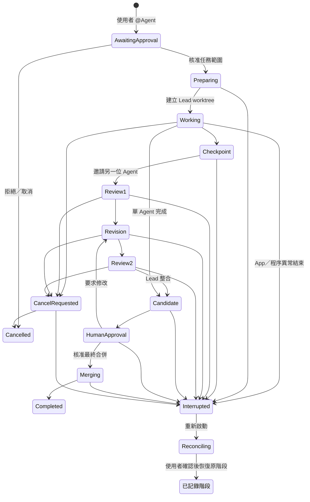

# Branchestra 設計規格

- 日期：2026-07-21
- 狀態：設計內容已核准，內部技術複核完成，等待使用者核准規格文件
- 產品名稱：Branchestra
- 專案識別：`branchestra`
- 授權：MIT

## 1. 摘要

Branchestra 是一套開源、local-first 的 macOS 桌面應用程式。它提供一個共享聊天室，讓使用者可以透過 `@Claude` 或 `@Codex` 指派工作；兩個 Agent 能讀取同一房間的歷史、在彼此隔離的 Git worktree 中工作、交換 checkpoint 與審查結果，最後由指定 Lead 產生整合候選版本，待使用者核准後才合併回專案。

Branchestra 不建立自己的 Claude 或 ChatGPT OAuth 流程。使用者必須自行安裝並登入官方 `claude` 與 `codex` CLI；應用程式只驗證 CLI 狀態並透過官方 SDK 沿用本機登入，不讀取、保存或轉送 OAuth token。預設的 Subscription-only Mode 不接受 API key fallback。

`Local-first` 在此表示 Branchestra 的資料庫、workflow 與 Git 成果由本機保存，且 Branchestra 沒有代管後端；它不代表模型在本機推論。使用者啟動 Agent 後，選入 context 的聊天、程式碼與工具結果仍會由官方 CLI 傳送給對應 Provider，並受其服務條款與資料政策約束。

## 2. 產品目標

### 2.1 MVP 目標

1. 加入一個既有、具有有效 `HEAD` 的本機 Git repository。
2. 在專案下建立多個持久化 Room，每個 Room 固定綁定一個 repository。
3. 在共享時間軸中透過 `@Claude` 或 `@Codex` 建立任務。
4. 每個任務只需一次範圍核准，之後 Agent 可在專屬 worktree 中讀寫、執行本機指令與測試。
5. Lead 可邀請另一個 Agent 平行實作或審查，最多進行兩輪自動合作。
6. Agent 透過 checkpoint commit 與 diff 交換成果，不直接修改對方的工作目錄。
7. Lead 建立整合候選版本，顯示 diff、測試結果、衝突和分歧。
8. 只有使用者核准後，才合併回指定的原始分支。
9. 聊天、任務、Agent session、worktree 與執行事件可在應用程式重新啟動後恢復。
10. 以已簽章及 notarized 的 arm64／x64 macOS 應用程式公開發佈，並可透過 Homebrew Cask 安裝。

### 2.2 非目標

MVP 不包含：

- Windows 或 Linux 桌面版。
- 雲端同步、遠端 SaaS orchestrator 或多人協作。
- 自訂第三方產品 OAuth 或代管使用者訂閱憑證。
- API key 模式或不明認證模式的自動 fallback。
- Claude、Codex 以外的 Provider。
- Agent 在應用程式完全退出後繼續執行的 daemon／LaunchAgent。
- 自動 `git push`、部署、發佈或刪除外部資源。
- Mac App Store 發佈。
- 離線或完全在裝置端執行的模型推論。
- 對任意、未受信任 repository 提供強安全隔離的雲端沙箱。

## 3. 已確認的產品決策

| 項目 | 決策 |
|---|---|
| 應用型態 | Electron macOS 桌面應用程式 |
| 前端 | React + Vite + TypeScript |
| Orchestrator | Electron `utilityProcess` 中的 Node.js 程序 |
| Agent 整合 | SDK-first Provider Adapters |
| Claude | Claude Agent SDK，沿用官方 Claude Code 登入 |
| Codex | `@openai/codex-sdk` 非互動模式，沿用官方 Codex CLI 登入 |
| 資料庫 | SQLite，WAL 模式 |
| 專案模型 | 一個 Room 固定綁定一個既有 Git repository；一個 Project 可有多個 Room |
| 任務啟動 | 必須由使用者 `@Agent` 啟動 |
| 合作上限 | 最多兩輪自動合作／審查 |
| 權限 | 任務範圍核准一次；外部或破壞性操作另行核准 |
| Git 隔離 | 每個執行 Agent 使用專屬 worktree 與 branch |
| 整合責任 | 被點名或由 UI 指定的 Lead 產生整合候選版本 |
| 最終合併 | 必須由使用者核准 |
| 介面 | Unified Timeline + 右側 Task Inspector |
| 認證邊界 | 使用者自行安裝及登入官方 CLI；應用程式不處理 OAuth token |
| 發佈 | GitHub Releases + 官方 Homebrew tap |
| macOS 產物 | arm64 與 x64 分開建置 |
| 簽章 | Apple Developer ID + hardened runtime + notarization |
| 授權 | MIT |

## 4. 系統架構



### 4.1 程序責任

**Renderer**

- 呈現 Project、Room、共享時間軸、任務狀態、diff、測試和核准介面。
- 不具備 Node.js、檔案系統或 shell 存取能力。
- 只能呼叫 preload 公開的具型別操作。

**Preload 與 Electron Main**

- `contextIsolation: true`、`nodeIntegration: false`、renderer sandbox 開啟。
- 驗證 IPC sender、payload schema 與允許的操作。
- 管理視窗、應用程式生命週期、選檔對話框和 utility process。
- 不執行長時間 Agent 工作，也不直接擁有 SQLite 連線。
- 取得 `app.requestSingleInstanceLock()`，監控 worker 的 spawn／exit／`child-process-gone`，並以 bounded backoff 重新啟動。
- Quit 時使用可重入的 `before-quit` handshake：先 `preventDefault()`、等待 worker `prepareQuit(deadline)` ACK，再進入真正退出；超時則執行受控終止。

**Utility Process / Orchestrator**

- 唯一擁有 workflow state machine、SQLite、Provider Adapter 與 Git Manager 的程序。
- 序列化同一 repository 的結構性 Git 操作。
- 將原始 Provider 事件先寫入資料庫，再轉成 UI 事件。
- 管理 cancellation、timeout、啟動 reconciliation 與 session resume；worker crash 的偵測和重新 spawn 由 Main supervisor 負責。
- 啟動時以 generation/version handshake 取得 durable worker lease；若偵測到另一個有效 owner，拒絕成為第二個 SQLite／Git owner。

此邊界讓 Renderer 或 Provider 串流異常不會直接拖垮全部狀態，並避免從 UI 暴露任意 shell 通道。

### 4.2 IPC、重播與程序監督

Main↔Worker 與 Renderer↔Main 訊息使用 versioned envelope，至少包含 protocol version、request ID、idempotency key、worker generation、payload type 與 bounded payload size。會改變狀態的 request 必須在 durable dedupe 記錄完成後才 ACK。

Renderer 或 worker 重啟時，不依賴記憶體事件接續：先取得包含最新 `room_seq` 的 snapshot，再要求 cursor 之後的 events。重複事件以 event ID／idempotency key 去重。

Provider 與測試命令透過可追蹤的 supervisor wrapper／process group 啟動。記錄 run ID、process-group ID、executable identity 與 start time；取消或 Quit 依序 TERM → deadline → KILL。重啟時只可終止同時通過 run ID、executable、start identity 驗證的 orphan，不能單憑重用風險很高的舊 PID。

## 5. Provider Adapter

Provider 差異必須封裝在窄介面後面。概念能力如下：

- `detect()`：找到並驗證 CLI 絕對路徑。
- `probeCapabilities()`：回報版本、可用功能和相容性。
- `getAuthStatus()`：確認官方 CLI 已登入、API key 路徑未啟用，並回報 Provider 可揭露的認證資訊；不從無法驗證的訊號推測帳務結果。
- `startRun()`：啟動新的 Agent run 並串流標準化事件。
- `resumeRun()`：在 Provider 支援時恢復既有 session/thread。
- `cancelRun()`：依 Provider capability 使用 protocol interrupt 或 process abort，再由 supervisor 依 deadline 升級終止。
- `normalizeEvent()`：將 Provider 原始事件轉成共用事件模型。

Adapter capability 不能只用單一布林值概括。至少要分別回報：

- `interactiveApproval`
- `protocolInterrupt`
- `processAbort`
- `textDeltaStreaming`
- `itemEventStreaming`
- `sessionResume`
- `workspaceWriteSandbox`
- `toolNetworkControl`

### 5.1 Claude Adapter

- 使用 Claude Agent SDK。
- 將 onboarding 驗證過的外部 `claude` executable 絕對路徑明確傳給 SDK，不以 SDK 可能附帶的 binary 代替使用者自行安裝的 CLI。
- 保存 Claude session ID，但不保存 OAuth token。
- 明確設定工作目錄、允許工具與 permission callback。
- 不使用跳過權限的危險模式。
- `canUseTool` 用於執行已核准 capability；若工具要求超出範圍，回傳拒絕並把控制權交回 Branchestra，不把 Provider callback 當成新的使用者核准來源。

### 5.2 Codex Adapter

- 使用 `@openai/codex-sdk`。
- 將 onboarding 驗證過的外部 `codex` executable 絕對路徑明確傳給 SDK，不以套件內 binary 代替使用者自行安裝的 CLI。
- 保存 Codex thread ID，但不保存 OAuth token。
- 明確設定 worktree 路徑、`approvalPolicy: "never"`、預先核准的 sandbox 與 tool network 狀態。
- 將串流事件轉成共用訊息、工具、diff、usage 與錯誤事件。
- TypeScript SDK 不被假設具有互動式 approval callback。若 Codex 需要目前 sandbox 之外的權限，該 run 必須 fail closed 並結束；Branchestra 建立新的 app-level approval，核准後以相同 thread 或 recovery context 開始下一個 run，不宣稱能原地續接被拒絕的工具。
- UI 依 capability 呈現串流；有 text delta 時逐字更新，否則呈現 item-level 即時事件，不承諾所有版本都有 token-level delta。

### 5.3 相容性策略

- SDK 使用精確版本鎖定，升級由 Renovate／Dependabot PR 或人工變更觸發，不自動漂移。
- 支援矩陣以 `(SDK version, external CLI version, macOS architecture)` 為單位；外部 CLI 的事件 schema 變更不能被 SDK lockfile 掩蓋。
- 每次啟動執行 capability probe；未通過支援矩陣時阻止工作並顯示修復指引。
- Adapter 以錄製的 Provider 事件建立 contract fixtures，容許未知欄位但拒絕缺少關鍵語義。
- 若 SDK 版本不再允許指定外部 executable，對應 Adapter 必須停用該 SDK 路徑；可改用官方 CLI JSONL fallback，但不改變 workflow、資料庫或 UI 契約。

## 6. Subscription-only 認證邊界

Branchestra 是公開的第三方本機工具，因此不提供「使用 Claude.ai／ChatGPT 帳號登入 Branchestra」的按鈕。Onboarding 只引導使用者：

1. 在 Branchestra 之外安裝官方 `claude` 與 `codex` CLI。
2. 使用官方流程完成登入。
3. 回到 Branchestra 執行狀態檢查。

執行 Agent 子程序時：

- 使用經驗證的 CLI 絕對路徑，不依賴 Finder 啟動時可能缺失的 shell `PATH`。
- 以 adapter-specific child environment allowlist 建立乾淨環境，而不是只刪除兩個已知變數；排除 API key、auth token、Bedrock／Vertex／Foundry、custom provider、custom base URL 與其他非訂閱登入來源。
- 禁止 SDK 的 `apiKey`、`baseUrl` 或 custom provider 選項，並使用實際將要啟動的外部 runtime 執行 auth-mode probe。
- 不提供 API key fallback；無法確認支援的登入狀態就停止。
- Token 不傳到 Renderer、不寫 SQLite、不出現在 diagnostic logs。
- UI 顯示 Provider、CLI 版本、登入可用性與「Subscription-only」狀態，但不顯示憑證內容。

只有 runtime 明確回報允許的 ChatGPT／Claude subscription auth mode 時才可執行；若該 CLI 版本無法可靠揭露 auth mode，對應組合不列入支援矩陣。Auth precedence 測試必須涵蓋 keychain 登入、儲存的 API key、環境 token、custom endpoint 與各雲端 Provider 切換。

Provider 最終如何計算、限制或改變訂閱額度仍由 Anthropic／OpenAI 決定。Branchestra 能保證的是：自身不配置 API key 計費路徑、只允許經測試且明確識別的訂閱登入、遇到不明認證模式時 fail closed，並透過相容性更新因應官方政策或 SDK 變更。

公開 release 前確認兩家 Provider 當時的開發者條款與訂閱使用政策是 release blocker。若任一 Provider 不允許這類本機第三方調用，MVP 不得宣稱同時支援兩者；對應 Adapter 應停用，而不是繞過政策或偷偷切換 API 計費。

## 7. 核心資料模型

SQLite 是 canonical source of truth；Provider session 不是聊天紀錄的唯一來源。

概念實體：

- `projects`：repository root、Git common dir、顯示名稱、預設 base branch。
- `rooms`：所屬 project、標題、持久摘要、已確認決策。
- `room_events`：append-only 事件、room sequence、事件類型、標準化內容。
- `provider_events`：原始 Provider payload、run ID、Provider sequence。
- `tasks`：需求、範圍、Lead、base commit、狀態、合作輪次。
- `approvals`：核准類型、範圍、使用者決定、時間與關聯操作。
- `agent_runs`：Provider、角色、session/thread ID、context version、狀態。
- `worktrees`：路徑、branch、base commit、目前 checkpoint、保留狀態。
- `checkpoints`：不可變 commit、作者 Agent、用途與建立時間。
- `test_results`：命令摘要、exit status、結構化結果和 log reference。
- `integration_candidates`：Lead branch、來源 checkpoints、diff summary 與驗證狀態。
- `operation_journal`：Git／程序等外部副作用的 intent、idempotency key、expected state、觀察結果與完成狀態。
- `worker_leases`：worker generation、PID／start identity、heartbeat 與 owner instance，用於防止雙重 owner。

最終合併 approval 必須綁定不可變輸入：`(target_ref, base_oid, candidate_oid, diff_hash, test_set_hash)`。任何值改變都使舊核准失效，狀態回到 `HumanApproval`。

資料庫使用 WAL、foreign keys 與 transaction。每個房間事件由 Orchestrator 配發單調遞增的 `room_seq`，讓 Claude、Codex 與工具事件同時抵達時仍可重建一致時間軸。SQLite 是 workflow 與事件的 canonical source；Git OID、ref、index 和工作目錄的實際狀態仍以 repository 為準，啟動時必須 reconciliation。

## 8. 共享聊天與 Context Builder

Branchestra 永久保留完整 Room 歷史；「兩個 Agent 都能讀取整個聊天」的實作語義是完整歷史可存取，而不是每次都把所有 token 重送給模型。

每次 Agent run 的 context bundle 包含：

1. 當前任務、核准範圍與 Lead／Reviewer 角色。
2. 最近聊天原文。
3. 持續更新的 Room 摘要與已確認決策。
4. 另一位 Agent 的訊息、checkpoint、diff、測試和工具摘要。
5. 與任務相關的較舊訊息與 artifacts。
6. 可搜尋並讀取完整舊對話的內部 context 工具。

每個 bundle 都保存 context version／hash，便於診斷兩個 Agent 是否基於不同狀態作答。Room 摘要不能取代原始紀錄；使用者可展開或搜尋全部歷史，Agent 也能按需取得原文。

完整歷史與唯讀 Git 查詢透過 Branchestra 管理的本機、read-only tools 暴露給兩個 Adapter，例如 `context.search/read` 與 `git.status/diff/show/log`。優先以 Provider 支援的 MCP／tool registration 接入；若支援矩陣中的某版本無法接入，Adapter 必須把等價結果明確注入 context，而不是讓 Agent 直接取得 SQLite 或 Git ref 寫權限。

## 9. 任務狀態機



### 9.1 合作規則

- 被 `@` 的 Agent 預設為 Lead；建立任務時也可由 UI 明確改選 Lead。
- Lead 可在已核准任務範圍內邀請另一位 Agent，不需要第二次核准。
- 第二位 Agent 可平行實作、審查或提出替代方案；其核准 writable root 只包含自己的 worktree，無法強制此限制的 Provider 組合不得啟動。
- 第一輪用於實作和交叉審查；第二輪用於修改和最終驗證。
- 達到兩輪後必須產生候選版本、結束或交還使用者，不得繼續自動互邀。
- 若 Agent 嘗試擴大需求或進行未核准操作，任務暫停並建立新的 approval request。
- `RecordedPhase` 代表從 durable state 恢復原本的 Preparing、Working、Review、Candidate 或 HumanApproval 階段，不是一律回到 Working；合作輪次也不重設。
- 使用者在 `HumanApproval` 要求修改時屬於 human-directed revision，不會自動增加合作輪次。若要再啟動 Agent-to-Agent round，必須由使用者明確給予新的輪次預算。
- 所有非終止狀態都有 cancel、fail 與 process-loss transition；規格圖只畫出主要路徑，實作的 transition table 必須逐一列出並測試。

## 10. Git 與 Worktree 策略

### 10.1 目錄和 branch

應用程式管理的 worktree 放置於：

`~/Library/Application Support/Branchestra/worktrees/<project-id>/<task-id>/<role>`

建議 branch 命名：

- `branchestra/<task-id>/lead`
- `branchestra/<task-id>/collaborator`

建立任務時固定記錄 base branch 與 base commit。每一個可審查階段都建立 checkpoint commit，Review 只針對已記錄的 checkpoint OID，不讀取對方正在變動的工作目錄。

Linked worktree 只提供並行工作的 working-tree 隔離，不是 repository 或安全隔離：所有 worktree 仍共享 object database、refs 與 common config。因此：

- Provider 只負責修改 sandbox 允許的工作樹內容。
- 所有會改變 Git index、refs、branches、worktrees 或 commits 的操作只能由 Git Manager 執行。
- Agent 需要的 `status`、`diff`、`show`、`log` 等唯讀資訊由 Branchestra Git tool 提供；直接從 shell 執行會改寫 Git 狀態的命令必須被 permission policy 和 sandbox 阻擋。
- Provider sandbox 對實際 Git common dir 不提供寫權限；路徑判斷使用 realpath，並加入 `..`、symlink 與 linked-worktree escape 的負向測試。

Checkpoint 由 Git Manager 建立，保存完整 commit OID，並建立不移動的 `refs/branchestra/checkpoints/<checkpoint-id>` 使 commit 不會在任務期間被 GC。所謂「不可變」指核准與 review 永遠綁定已記錄 OID；該 ref 不得被移動，只有在經核准的清理流程中刪除。

### 10.2 整合

- Lead worktree 同時作為 integration candidate worktree。
- Lead 選擇要採用的 Collaborator checkpoints；實際 cherry-pick／merge 由 Git Manager 執行，Lead 再於自己的 worktree 處理檔案衝突並重新執行測試。
- Branchestra 管理的 checkpoint、cherry-pick 與 merge 使用 app-local Git identity，並停用 repository hooks，避免 checkpoint 動作意外觸發 push、deploy 或其他外部副作用；不修改使用者的 global Git config。
- 原始 repository 的 base branch 在最終核准前不變。
- 最終核准綁定 `target_ref`、`base_oid`、`candidate_oid`、`diff_hash` 與 `test_set_hash`。整合鎖內重新讀取全部值；任何一項不同都使舊核准失效，候選版本必須更新、重新驗證並回到 `HumanApproval`。
- 若目的 branch 正在主要工作目錄中 checkout，最終合併要求該工作目錄乾淨；有未提交變更時停止，不自動 stash 或覆寫使用者檔案。
- 任務可以從乾淨的 `HEAD` commit 開始，即使主要工作目錄另有未提交變更；UI 必須明確警告那些未提交變更不會包含在 Agent 的 base snapshot 中。

最終合併是有 compare-and-swap 保護的 Git Manager operation：

1. 先把 operation intent、expected OID 與 idempotency key 寫入 journal。
2. 若 target ref 在任一 linked worktree checkout，找到真正 owner、確認 index／working tree 乾淨且無進行中的 Git operation，再於該 worktree 執行停用 hooks 的 `git merge --ff-only`。
3. 若 target ref 未在任何 worktree checkout，使用 `git update-ref <target> <candidate_oid> <base_oid>` 做 atomic CAS。
4. 重新觀察 ref、index 與 working tree，確認結果後才將 journal 標記完成。
5. CAS 失敗或外部 Git 在鎖外改變狀態時，停止並回到候選審查，不沿用舊核准。

### 10.3 並行與清理

- 同一 Project 可執行多個任務，但 worktree add/remove、branch mutation 與最終整合使用 repository-scoped lock。
- 取消、失敗或中斷任務不自動刪除 branch、worktree 或未提交變更。
- 清理屬於可見、可復原的使用者操作；刪除含未提交內容的 worktree 需要額外確認。

## 11. 核准與安全政策

任務核准是一份可持久化的 capability receipt。核准畫面至少列出 repository、可寫路徑、允許的本機命令類型、是否可邀請另一 Agent、一般工具網路存取與時間／合作輪次上限。Provider 本身連線到模型服務是執行 Agent 的必要條件；Agent 工具另外連線到任意網站、套件 registry 或外部服務則是獨立的 `toolNetwork` capability，預設關閉，若任務需要可在最初一次核准中明確開啟。

### 11.1 任務核准涵蓋

- 在指定任務 worktree 中讀寫 repository 檔案。
- 執行與任務相關的本機開發命令和測試。
- 在同一任務範圍內邀請第二個 Agent。
- 建立 Branchestra 管理的 branch、worktree 與 checkpoint commit。
- 使用核准畫面中已明確列出的 `toolNetwork` 能力；這不授權修改外部系統。

### 11.2 必須另行核准

- 修改任務 worktree 之外的檔案。
- 刪除使用者資料或含未提交變更的 worktree。
- `git push`、建立 PR、部署、發佈或呼叫會改變外部狀態的服務。
- `sudo`、系統設定、安裝全域套件或存取額外目錄。
- 啟用原核准範圍未包含的一般工具網路存取。
- 超出原需求的額外工作。

Provider 原生 sandbox、Claude 可用時的 permission callback 與 Branchestra approval policy 同時使用；Codex SDK 非互動模式依賴預先設定的 sandbox，不能假裝具有 callback。Renderer 不提供任意命令 IPC；Orchestrator 以 argv 啟動已知 executable，避免以 shell 字串拼接核心操作。這些限制降低本機自動化風險，但不把本機 Agent 宣稱為惡意 repository 的強隔離安全邊界。

每個支援矩陣組合必須有可驗證的 enforcement profile：canonical writable roots、readable roots、child environment allowlist、tool network 狀態、Git common dir 禁寫、額外 executable／directory 能力，以及 Provider 特有的 sandbox 設定。Agent 啟動的測試與 child processes 套用相同邊界。若某版本無法強制已核准 capability，該組合必須 fail closed，不能只靠 prompt 提醒 Agent。

安全負向測試至少涵蓋：`../` 越界、symlink 指向外部路徑、直接改寫 Git common dir／其他 ref、網路關閉時連線、未允許環境憑證、child process 逃逸與測試腳本寫入額外目錄。Worktree 是避免協作覆寫的機制，不單獨作為上述安全保證。

## 12. 中止、失敗與恢復

### 12.1 Cancellation

取消流程：

1. 任務進入 `CancelRequested`，停止派送新工作。
2. 呼叫 Provider 的 Abort／interrupt 能力。
3. 在有限 grace period 內等待工具安全結束；只有宣告 `protocolInterrupt` 的 Adapter 才使用協定中止，其他 Adapter 直接進入 process abort。
4. 超時後由 supervisor 終止整個受追蹤 process group，而不只 Provider 的直接 child。
5. 保存最後事件與 Git 狀態，標記 `Cancelled` 或 `Failed`。

### 12.2 應用程式結束

- Quit 時若有執行中任務，顯示警告。
- 使用者確認 Quit 後，套用 cancellation grace period，保留狀態並把未完成任務標記為 `Interrupted`。
- MVP 不在 App 完全退出後繼續執行 Agent。

### 12.3 重新啟動

啟動時執行 reconciliation：

1. 讀取 SQLite 中未完成任務。
2. 驗證 repository、worktree、branch、checkpoint 與未提交 diff。
3. 檢查 Provider session/thread 是否具備恢復能力。
4. 掃描未完成的 operation journal：比較 intent 的 expected OID／process identity 與實際外部狀態，判斷操作尚未發生、已完成或處於需要人工處理的不確定狀態。
5. 顯示恢復預覽，由使用者選擇繼續或保留現況。
6. 優先恢復原 session；失敗時建立新 session，注入 recovery brief、最新 context bundle 與 Git 狀態。

Branchestra 不宣稱能從被中斷的半個 token 或正在執行一半的 shell command 精確續接。它恢復的是持久狀態、Provider 對話（若支援）、檔案成果和下一個安全 workflow transition。任何可能產生副作用的 prompt 都不會在 crash 後自動重播。

SQLite transaction 無法包住 Git 或 process side effect，因此所有這類操作遵循 `record intent → execute idempotently/CAS → observe actual state → mark complete`。程序 generation 改變後，尚未執行的敏感 approval 失效。若 crash 發生於 `Merging`，系統先檢查 target ref、owner worktree index 與 merge state；已完成則記錄結果，未完成或不確定則回到使用者，不自動重播 merge。

## 13. 桌面 UX

主要視窗為三欄：

```text
┌──────────────┬──────────────────────────────┬─────────────────┐
│ Projects     │ Shared Timeline              │ Task Inspector  │
│ └─ Rooms     │ User / Claude / Codex        │ Agent 狀態      │
│              │ 工具摘要、審查、核准事件      │ Worktrees       │
│              │                              │ Diff / Tests    │
├──────────────┴──────────────────────────────┴─────────────────┤
│ @Claude / @Codex 輸入框                          Stop / Send   │
└───────────────────────────────────────────────────────────────┘
```

### 13.1 Onboarding

1. 顯示 Branchestra 的 local-only 與認證邊界。
2. 搜尋常見 CLI 位置，或讓使用者選取 executable。
3. 顯示 Claude／Codex 的版本、登入和 capability 狀態。
4. 加入既有 Git repository。
5. 建立第一個 Room。

### 13.2 Timeline

- User、Claude、Codex 使用一致但可辨識的身份樣式。
- Provider 串流即時顯示，並提供停止按鈕。
- 工具呼叫、命令與長 log 預設摺疊為可讀摘要，可展開原始內容。
- Approval、checkpoint、test、interrupt 與 error 是一等 timeline event，不藏在 Agent 文字裡。
- 房間歷史可搜尋，並可跳到被引用的訊息或 checkpoint。

### 13.3 Task Inspector

顯示：

- 任務範圍、Lead、狀態與目前合作輪次。
- Provider session 狀態與取消控制。
- Worktree 路徑、branch、base 和 checkpoint。
- Diff summary、測試結果、衝突與未解決的 Agent 分歧。
- 待核准操作與最終合併按鈕。

### 13.4 不可信內容邊界

Provider 訊息、repository Markdown、diff、檔名、ANSI log 和 test output 全部視為不可信輸入：

- 設定嚴格 Content Security Policy，只載入打包資源，不允許任意 inline script 或遠端內容。
- Markdown renderer 關閉 raw HTML，輸出經過 sanitizer；程式碼、diff、ANSI 與 SVG 不得以未消毒 HTML 注入 DOM。
- 不使用 `<webview>`；拒絕 renderer navigation、任意 `window.open` 與未授權的新視窗。
- 外部連結只允許受控 scheme／domain，且必須由明確使用者手勢經 Main 驗證後才可 `shell.openExternal`。
- Agent 文字不能生成可直接呼叫 IPC 的核准按鈕。Approval UI 只能由可信的結構化 app event 建立，點擊時仍重新驗證 worker generation 與 approval hash tuple。
- E2E 安全測試注入惡意 Markdown、HTML、連結、檔名、ANSI escape 與假 approval 內容，確認無法觸發合法 IPC、navigation 或合併。

## 14. 隱私、診斷與資料位置

- 應用程式資料預設位於 `~/Library/Application Support/Branchestra`。
- Branchestra 的持久資料庫、事件記錄和 Git metadata 只由本機保存；MVP 沒有 Branchestra 雲端後端或同步服務。
- Agent 執行時，context 中的聊天、程式碼、diff 與工具結果會透過官方 CLI 傳送給 Anthropic 或 OpenAI。首次啟動及每次新增 Project 時都要清楚揭露這件事。
- SQLite 與原始 Provider events 可能含有敏感程式碼；MVP 依賴 macOS 使用者帳號權限與 FileVault，不宣稱提供獨立的端對端資料庫加密。
- 不預設收集遙測或崩潰內容。
- 本機 rotating logs 必須遮蔽環境變數、token 和常見 secret patterns。
- 使用者可主動匯出一份經遮蔽的 diagnostic bundle，再自行決定是否附到 GitHub issue。
- UI 提供 Room／Project metadata 移除和 worktree 清理流程；含工作成果的刪除需明確確認。

## 15. 開源發佈

### 15.1 Repository 與套件識別

- GitHub repository：`branchestra`
- App display name：`Branchestra`
- Homebrew cask：`branchestra`
- License：MIT
- Bundle ID：待 GitHub owner／publisher namespace 確認後採真正 reverse-DNS 格式，不使用未持有的網域。

### 15.2 macOS 產物

- Apple Silicon arm64 DMG。
- Intel x64 DMG。
- Cask 依 CPU architecture 選取對應 URL 與 checksum。
- 使用 Apple Developer ID Application 憑證、hardened runtime 與 notarization。
- GitHub Actions 以矩陣建置、測試、簽章、notarize、staple、產生 checksums 並建立 GitHub Release。
- Release 完成後更新自有 Homebrew tap。
- Release 附帶第三方授權 notices；含 native module 的 Electron／SQLite 依賴必須針對 arm64、x64 分別重建並完成 ASAR unpack 驗證。
- 公開 app 不重新散佈 `claude` 或 `codex` executable；使用者安裝的官方 CLI 保持為外部依賴。Release 前需稽核 SDK 與所有 runtime dependency 的授權及散佈條款。

安裝與更新介面：

```bash
brew install --cask <github-owner>/tap/branchestra
brew upgrade --cask branchestra
```

MVP 不加入獨立靜默 auto-updater；GitHub Releases 提供手動 DMG，Homebrew 安裝則由 Homebrew 更新，避免兩套更新機制互相覆蓋。

## 16. 測試策略

### 16.1 Unit tests

- Workflow 合法 transition、兩輪上限與停止條件。
- Approval scope 與外部副作用分類。
- Approval tuple hash、generation mismatch 與內容改變後失效。
- Context selection、摘要版本與歷史 retrieval。
- Provider event normalization。
- Repository path、branch name 與 IPC schema validation。

### 16.2 Contract tests

- 對錄製的 Claude／Codex 事件 fixtures 驗證 Adapter。
- 未知欄位、事件順序變化、partial stream 與版本不相容案例。
- CLI detection、auth status 和 capability probe。
- `(SDK, CLI, architecture)` 支援矩陣、Codex 非互動 permission failure，以及不同 interrupt／streaming capability。
- Auth precedence：keychain subscription、儲存 API key、環境 token、custom endpoint 與雲端 Provider 模式。

### 16.3 Integration tests

- 使用暫存 Git repository 建立兩個 worktree、checkpoint、cross-review、Lead 整合和衝突。
- Base branch 前進、主要工作目錄 dirty、取消後保留成果等安全案例。
- Git Manager exclusive mutation、checkpoint OID refs、approval CAS、checkout owner 偵測與外部 Git race。
- SQLite transaction、WAL recovery、duplicate event 與 room sequence。
- Operation journal 在每一個 intent／execute／observe 邊界 crash 的恢復。
- Mock Provider process 的 cancellation、timeout、process-group orphan、worker crash、bounded restart 與 resume。
- Sandbox escape matrix：path traversal、symlink、Git common dir、child process、env credential 與 tool network。

### 16.4 Electron E2E

- Onboarding 與 Provider health 畫面。
- 加入 Git project、建立 Room、`@Agent`、任務核准和即時 timeline。
- 雙 Agent 合作、最終 diff／test review 與合併核准。
- App 重啟後的 Interrupted task 恢復。
- Renderer 無法直接存取 Node／filesystem／shell。
- Snapshot + `room_seq` cursor replay、worker generation mismatch 與 duplicate command。
- 惡意 Provider/repository Markdown、diff、ANSI、連結與假 approval 無法觸發 navigation 或合法 IPC。

### 16.5 Release verification

- 在 arm64 與 x64 Mac 驗證 DMG、簽章、notarization、Gatekeeper 和 Homebrew 安裝。
- 真實 Provider smoke tests 只在人工控制、已登入的測試 Mac 上執行；CI 不保存消費者 OAuth 憑證。

## 17. MVP 驗收標準

MVP 完成必須同時滿足：

1. 從 Finder 啟動時能透過絕對路徑找到並驗證兩個 CLI。
2. Release gate 已確認 Provider 政策允許，且 Subscription-only Mode 的 auth precedence matrix 證明實際 runtime 為允許的訂閱登入；未知模式一律 fail closed。
3. Onboarding 清楚說明 Branchestra 本機保存資料，但 Agent context 仍會送到對應 Provider；使用者能在揭露後加入 Git repo、建立 Room，並在重啟後看見完整歷史。
4. `@Claude` 或 `@Codex` 會先建立可閱讀的 approval request，而不是立即修改檔案。
5. 核准後，支援矩陣的 sandbox escape tests 證明 Agent tool writes 被限制於核准 writable roots；邀請第二 Agent 時使用第二個 worktree，所有 Git mutation 仍只由 Git Manager 執行。
6. 兩個 Agent 都能取得一致的 Room 決策與彼此最新 checkpoint。
7. 自動合作不超過兩輪且可隨時取消。
8. Lead 能產生包含 diff、test results 與風險的整合候選版本。
9. 未經綁定確切 OID／hash 的最終核准不會改變 base branch；任何內容或 base 變更都使核准失效，dirty primary worktree 不會被自動覆寫或 stash。
10. Crash／Quit 後可恢復任務狀態與 Git 成果，且不自動重播副作用操作。
11. 公開 release 可在 arm64／x64 macOS 通過 Gatekeeper，並由 Homebrew Cask 安裝。
12. 單一實例、worker lease、process-group cleanup 與 operation journal 測試證明 crash／Quit 不會留下第二個 workflow owner 或未追蹤的 Agent process。

## 18. 主要風險與緩解

| 風險 | 緩解 |
|---|---|
| Provider 改變 SDK、事件或訂閱政策 | Adapter 邊界、精確鎖版、capability probe、contract fixtures、fail closed |
| Provider 政策不再允許第三方本機訂閱調用 | Release 前政策 gate；停用對應 Adapter，不繞過或切換隱藏計費路徑 |
| Finder 啟動缺少 shell PATH | 探測、保存及驗證 CLI 絕對路徑 |
| 兩個 Agent 互相覆寫 | 每 Agent 專屬 worktree；只交換 checkpoint OID；Git Manager 獨占 Git mutation |
| Agent 無限互邀或成本失控 | 固定兩輪上限、timeout、取消與 workflow transition guard |
| Context 過長或雙方認知分歧 | SQLite canonical history、持久摘要、relevant retrieval、context hash |
| Crash 造成狀態與 Git 不一致 | 原始事件先寫入、SQLite transaction、啟動 reconciliation |
| Base branch 在工作期間變更 | 建立時固定 base commit；最終合併前重新驗證和測試 |
| 核准後 candidate／tests 被替換 | Approval 綁定 target/base/candidate/diff/test hashes；任一變更即失效；Git CAS |
| 使用者主要工作目錄有未提交內容 | 不自動 stash／覆寫；最終合併前要求乾淨並清楚提示 |
| 本機 Agent 執行危險操作 | 可驗證 enforcement profile、task scope、額外 approval、Git Manager、無任意 Renderer shell IPC |
| Worker crash 留下 Provider／test grandchildren | Main supervision、durable lease、受追蹤 process group、TERM/KILL deadline、orphan identity 驗證 |
| Provider 或 repository 內容攻擊 Renderer | CSP、消毒、禁止 raw HTML/webview/navigation、可信結構化 approval UI、惡意內容 E2E |
| 使用者把 local-first 誤解為資料不離開裝置 | Onboarding／Project disclosure 清楚列出會送到 Provider 的 context 類型 |
| 公開 app 被誤認為官方 Claude／OpenAI 產品 | 中立品牌、明確第三方聲明、不使用 Provider 商標作產品名稱 |

## 19. 實作前待填設定

以下不影響架構核准，但在 release pipeline 前必須確定：

- GitHub owner／organization 與 Homebrew tap repository。
- 真正的 reverse-DNS bundle ID。
- Apple Developer Team ID 與 GitHub Actions signing secrets。
- MVP 支援的最低 macOS、Claude CLI、Codex CLI 及 SDK 版本。
- 預設 run timeout、cancel grace period、log retention 與資料庫備份數量。

這些值應集中於 typed configuration，不能散落在 Provider Adapter 或 UI 中。

## 20. 參考資料

- [Claude Agent SDK overview](https://platform.claude.com/docs/en/agent-sdk/overview)
- [Using the Claude Agent SDK with a Claude plan](https://support.claude.com/en/articles/15036540-use-the-claude-agent-sdk-with-your-claude-plan)
- [OpenAI Codex SDK](https://learn.chatgpt.com/docs/codex-sdk)
- [Electron utilityProcess](https://www.electronjs.org/docs/latest/api/utility-process)
- [Electron security recommendations](https://www.electronjs.org/docs/latest/tutorial/security)
- [Homebrew Cask Cookbook](https://docs.brew.sh/Cask-Cookbook)
- [Apple: Notarizing macOS software before distribution](https://developer.apple.com/documentation/security/notarizing-macos-software-before-distribution)
